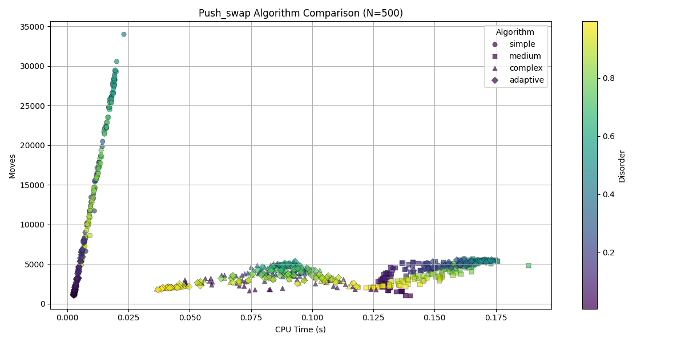

# perf-pushswap
## Push_swap Benchmarking Tool

A command-line tool to benchmark different `push_swap` sorting algorithms and visualize their behavior. Supports multiple algorithms, adjustable input sizes, multiple runs, and automatic plot generation.

---

## Description

`perf-pushswap` benchmarks your `push_swap` executable by generating **random integer sequences** and measuring:

- Number of **moves** performed  
- Execution **time**  
- Initial **disorder** of the sequence  

Results are saved as CSV and plots for easy comparison.

---

## Requirements

- Python 3.8+  
- Bash (for `bench` CLI)  
- `matplotlib` and `pandas` (installed automatically in venv)  

---

## Installation

```bash
git clone https://github.com/dimenoste/perf-pushswap.git 
cd perf-pushswap
chmod +x bench src/benchmark.py  # optional, Git preserves executable bit
```

---

## Usage

### Help

```bash
./bench --help
```

**Output:**
```
Usage: ./bench [options] <push_swap_path> <algorithm> <size> [runs]

Arguments / Options:
  <push_swap_path>   Path to push_swap executable
  <algorithm>        simple | medium | complex | adaptive | compare
  <size>             Number of integers (positive integer)
  [runs]             Number of runs per algorithm (default: 200)
  --clean            Remove all CSVs and plots
  clean              Same as --clean
```

---

### Benchmark Single Algorithm

```bash
./bench ./push_swap simple 10 5
```

- Benchmarks `simple` algorithm  
- 10 integers, 5 runs  

**Example Output:**
```
run=1/5 algo=simple disorder=0.42 moves=12 time=0.0023s
...
Saved raw data: data/simple_n10.csv
Saved plot from CSV: plots/simple_n10.png
```

---

### Compare All Algorithms

```bash
./bench ./push_swap compare 500
```

- Runs: `simple`, `medium`, `complex`, `adaptive`  
- Size = 500, default runs = 200  

**Example Output:**
```
Saved raw data: data/simple_n500.csv
Saved raw data: data/medium_n500.csv
Saved raw data: data/complex_n500.csv
Saved raw data: data/adaptive_n500.csv
Saved comparison plot: plots/compare_n500.png
```

**Example Plot:**



---

### Clean Data and Plots

```bash
./bench clean
```

**Output:**
```
Removed folder: data
Removed folder: plots
Clean complete.
```

---

## Output Files

| File | Description |
|------|-------------|
| `data/<algorithm>_n<size>.csv` | Raw benchmark results |
| `plots/<algorithm>_n<size>.png` | Plot of moves vs CPU time for a single algorithm |
| `plots/compare_n<size>.png` | Comparison plot of all algorithms |

---

## Interpreting Plots

- **X-axis:** CPU time (seconds)  
- **Y-axis:** Number of moves  
- **Color:** Initial disorder (0 = sorted, 1 = random)  

**Insights:**

- Steep slope → scales poorly with disorder/size  
- Flat slope → more efficient  
- Comparison plots show relative efficiency of multiple algorithms  
- Example: `adaptive` often uses fewer moves on nearly sorted sequences.

---

## Notes

- `push_swap` executable must exist and be executable.  
- Algorithms: `simple`, `medium`, `complex`, `adaptive`, `compare`  
- `size` must be a positive integer > 1 and ≤ `MAX_INT` (default 1000)  
- Each run uses a unique sequence with a disorder from 0.01 to 0.99. Run value must be greater than 2.
