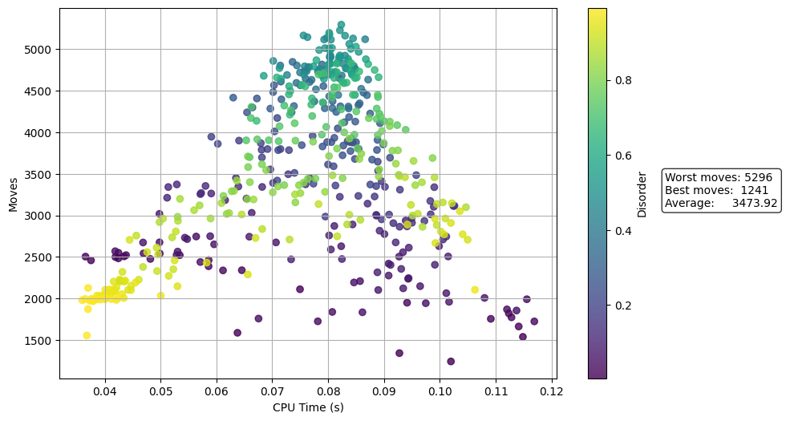

# perf-pushswap

Simple CLI to benchmark a `push_swap` executable.

It generates random sequences, runs `push_swap`, and records:
- number of moves
- execution time

Results are saved as **CSV files and plots**.

---

# Quick Start

Go to your **push_swap project folder** and run :
---

run this inside your push swap folder
```bash
make

git clone https://github.com/dimenoste/perf-pushswap.git
cd perf-pushswap

cp ../push_swap ./push_swap

./bench ./push_swap 100
```

This runs **200 benchmarks sorting 100 numbers**.

Results appear in:

```
data/
plots/
```

Requirements:
- Python 3.8+
- Bash

---

# Usage

```
./bench <push_swap_path> [size] [algorithm] [runs]
```

Arguments:

```
<push_swap_path>   path to push_swap executable
[size]             number of integers (>1)
[algorithm]        simple | medium | complex | adaptive | compare
[runs]             number of runs (default 200)
```

---

# Examples

### Default benchmark

```bash
./bench ./push_swap 100
```

100 numbers, 200 runs.

---

### Benchmark a specific algorithm

```bash
./bench ./push_swap 500 complex 500
```

- algorithm: `complex`
- size: 500
- runs: 500



---

### Compare algorithms

```bash
./bench ./push_swap 500 compare 100
```

Runs:
- `simple`
- `medium`
- `complex`

Produces a comparison plot.

---

# Clean generated data

```bash
./bench clean
```

Removes:

```
data/
plots/
```

---

# Output

```
data/<algorithm>_n<size>.csv
plots/<algorithm>_n<size>.png
plots/compare_n<size>.png
```

---

# Notes

- `push_swap` must be executable.
- `size` must be >1 and ≤1000.
- `runs` must be >2.
